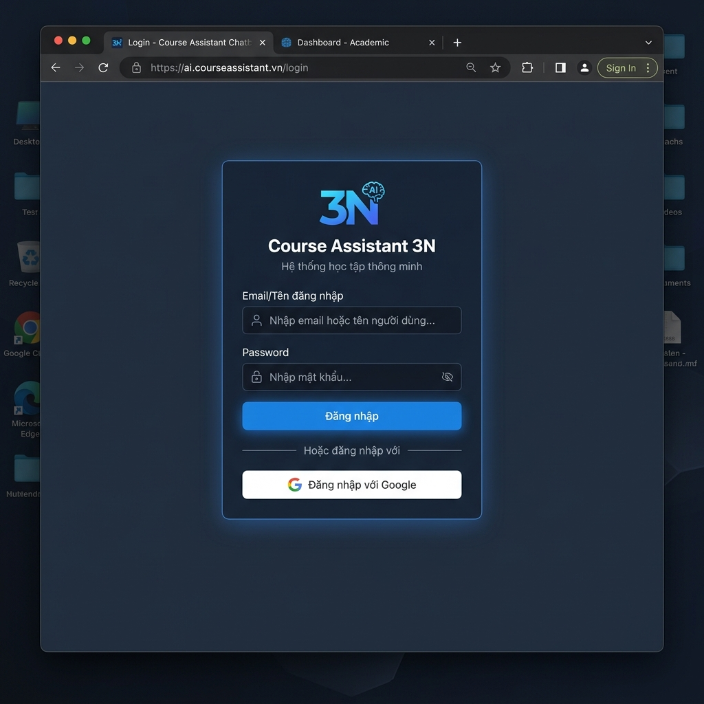
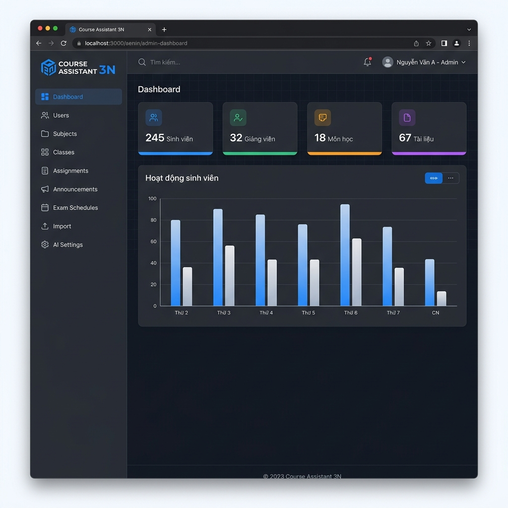
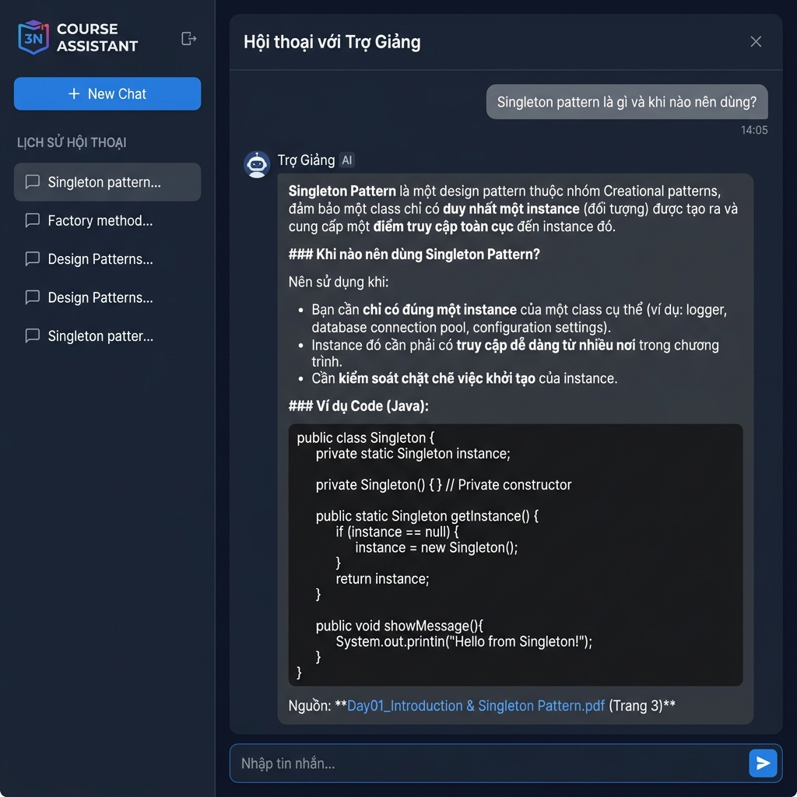
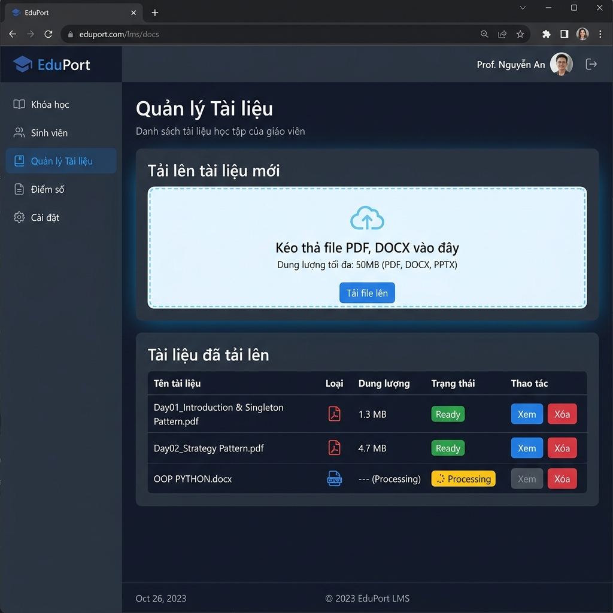

# Course Assistant Chatbot – 3N

> **LMS + RAG-powered AI Chatbot** | Django · React · ChromaDB · MySQL

A Learning Management System (LMS) that integrates a Retrieval-Augmented Generation (RAG) AI chatbot to let students ask questions about course materials uploaded by their teachers – and get accurate, document-grounded answers in real time.

---

## Overview

Course Assistant 3N is a full-stack academic platform supporting three roles:

- **Admin** – manages users, subjects, classes, exam schedules, and AI configuration
- **Teacher** – uploads course documents (PDF/DOCX), creates quizzes, monitors students
- **Student** – chats with an AI that answers based on actual lecture materials, takes quizzes, views exam schedules

The core differentiator is a **RAG pipeline** that grounds every AI answer in documents uploaded by teachers, reducing hallucination and making responses course-specific.

---

## Tech Stack

| Layer | Technology |
|---|---|
| **Frontend** | React 18, TypeScript, Vite, Tailwind CSS, Radix UI, React Router, Recharts |
| **Backend** | Django 5.2, Python 3.9+, Django REST (custom), PyJWT |
| **Database** | MySQL 8.0 (21 tables), Django ORM |
| **Vector DB** | ChromaDB (HTTP client) |
| **Embeddings** | Sentence Transformers – `all-MiniLM-L6-v2` (local, no API cost) |
| **LLM** | OpenAI GPT via LangChain (OpenRouter compatible) |
| **Auth** | JWT + Google OAuth 2.0 |
| **Doc Parsing** | pypdf, python-docx |

---

## Key Features

- 🤖 **RAG Chat** – student questions answered from teacher-uploaded PDF/DOCX via Hybrid Search (Semantic + Keyword + RRF)
- 📅 **Exam Schedule Queries** – intent-routed to structured DB, not vector store
- 📝 **AI Quiz Generation** – auto-generate MCQ quizzes from course material
- 👩‍🏫 **Teacher Document Manager** – upload, track ingestion status, delete documents
- 📊 **Admin Dashboard** – user stats, system settings, bulk Excel import
- 🔑 **Google OAuth + JWT** – secure authentication
- 📧 **OTP Email Reset** – password recovery via Gmail SMTP
- 🌙 **Dark Mode UI** – modern responsive React interface

---

## My Responsibilities

- Designed and implemented the **RAG pipeline** end-to-end: file parsing → text cleaning → chunking → embedding → ChromaDB storage → hybrid retrieval → LLM prompting → streaming SSE response
- Built the **Django REST backend** with role-based access control (Admin / Teacher / Student)
- Designed the **MySQL schema** (21 tables) and all ORM models
- Implemented **JWT authentication** and Google OAuth integration
- Developed the **React frontend** with TypeScript: chat interface, dashboards, admin panels
- Wrote **unit tests** for chunking, document ingestion, vector store, RAG service, and auth
- Authored technical documentation: [RAG Architecture](docs/rag-architecture.md), setup guide

---

## Screenshots

| Login | Admin Dashboard |
|---|---|
|  |  |

| Student Chat (RAG) | Teacher Documents |
|---|---|
|  |  |

---

## RAG Pipeline (Summary)

```
Upload PDF/DOCX → Parse text → Clean → Chunk (1200 chars, 150 overlap)
→ Embed (all-MiniLM-L6-v2, 384-dim) → Store in ChromaDB

Student question → Classify intent → Hybrid retrieval (Semantic + Keyword, RRF)
→ Filter by relevance threshold → Build prompt → Stream GPT response → Save to history
```

See [docs/rag-architecture.md](docs/rag-architecture.md) for the full pipeline diagram and design decisions.

---

## Setup Instructions

### Prerequisites

- Python 3.9+
- Node.js 18+
- MySQL 8.0
- ChromaDB (running as HTTP server on port 8001)

### 1. Clone the repository

```bash
git clone https://github.com/MinhQuan-22/Course-Assistant-Chatbot.git
cd course-assistant-chatbot
```

### 2. Configure environment variables

```bash
# Backend
cp .env.example backend/.env
# Edit backend/.env with your DB credentials, API keys, etc.

# Frontend
cp frontend/.env.example frontend/.env.local
# Edit frontend/.env.local with your Google Client ID
```

### 3. Set up the database

```bash
mysql -u root -p
CREATE DATABASE course_assistant_db CHARACTER SET utf8mb4;
exit

mysql -u root -p course_assistant_db < backend/db/schema.sql
mysql -u root -p course_assistant_db < backend/db/seed.sql
```

### 4. Run the backend

```bash
cd backend
python -m venv venv
source venv/bin/activate        # Windows: venv\Scripts\activate
pip install -r requirements.txt
python manage.py runserver 8000
```

### 5. Start ChromaDB

```bash
chroma run --host localhost --port 8001
```

### 6. Run the frontend

```bash
cd frontend
npm install
npm run dev
# App available at http://localhost:5173
```

---

## Demo Accounts

All accounts use password: **`123456`**

| Role | Email / Username |
|---|---|
| Admin | `admin.3n@tdtu.edu.vn` or `admin.3n` |
| Teacher | `tuan.tran@tdtu.edu.vn` or `tuan.tran` |
| Teacher | `hoa.le@tdtu.edu.vn` or `hoa.le` |
| Student | `an.nguyen@student.tdtu.edu.vn` or `an.nguyen` |
| Student | `binh.pham@student.tdtu.edu.vn` or `binh.pham` |

---

## Project Structure

```
course-assistant-chatbot/
├── backend/
│   ├── config/           # Django settings (env-based), URLs, WSGI
│   ├── core/
│   │   ├── services/     # RAG pipeline: rag_service, vector_store, chunking,
│   │   │                 #               document_ingestion, file_parser, quiz_service
│   │   ├── models.py     # 21 Django ORM models
│   │   ├── views*.py     # API endpoints per role
│   │   ├── auth_utils.py # JWT + bcrypt utilities
│   │   └── tests.py      # Unit tests (Chunking, Ingestion, VectorStore, RAG, Auth)
│   ├── db/               # schema.sql + seed.sql
│   ├── uploads/          # Runtime upload dir (not tracked in Git)
│   └── requirements.txt
├── frontend/
│   └── src/
│       ├── components/   # Chat, UI (shadcn), layout, sidebar
│       ├── pages/        # ChatPage, AdminDashboard, TeacherDashboard, etc.
│       └── contexts/     # AuthContext, DialogContext
├── docs/
│   ├── rag-architecture.md   # Full RAG pipeline documentation
│   └── screenshots/          # UI screenshots for README
├── sample_documents/         # Demo documents for testing the RAG pipeline
├── .env.example              # Backend env template
├── frontend/.env.example     # Frontend env template
└── README.md
```

---

## Notes

- `backend/uploads/` is excluded from Git – upload documents after local setup
- `sample_documents/` contains demo PDFs/DOCX for testing the RAG pipeline
- The system supports both OpenAI (direct) and OpenRouter models – configure in Admin → AI Settings
- ChromaDB must be running before uploading documents or using the chat feature
- This is an academic project built for learning and portfolio purposes

---

## Video Demo

👉 **[Watch full demo on YouTube](https://youtu.be/DdiXt_2HFug?si=pJHVW5sr3c_kaSHm)**

---

## License

Academic / personal project – built for learning and portfolio purposes.
